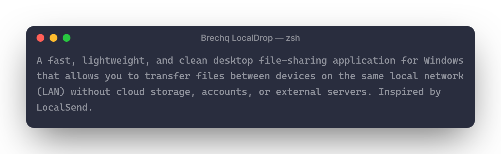

---

## Features

- **Zero Cloud & Direct LAN Transfer**: Transfers stream directly point-to-point over your local network using native HTTP streaming and UDP discovery.
- **Automatic Device Discovery**: Discovers other devices running Brechq LocalDrop on your Wi-Fi/LAN in real-time via UDP broadcast and multicast.
- **Share to Phone (QR Code & Mobile Web Preview)**: Share files directly to smartphones (Android & iOS) with zero app install needed. Mobile users simply scan the QR code to open an instant preview (photos, videos with audio/seek, music, documents) and download directly over Wi-Fi.
- **Clean & Functional UI**: Simple, modern desktop utility design with zero AI-generated clutter, glowing cards, or excessive gradients.
- **Drag & Drop**: Easily drop multiple files or choose files via the native Windows file picker.
- **Safe Conflict Resolution**: Prevents accidental overwrites by saving duplicate files as `filename (1).ext`.
- **Live Transfer Progress**: Real-time progress bar, transfer speed (MB/s), estimated time remaining, and bytes transferred.
- **Transfer History**: Local history log of sent and received transfers with direct "Show in folder" shortcuts.
- **Customizable Settings**: Configurable device name, download folder, optional auto-accept transfers, and Windows startup toggle.
- **Branded States**: Success state using `downloaded.jpg` ("Downloaded!") and error state using `failed.jpg` ("Download failed").

---

## Requirements

- **Operating System**: Windows 10 or Windows 11 (64-bit)
- **Node.js**: v18.x or higher (Node v24 recommended)
- **Network**: Local Wi-Fi or Ethernet connection with UDP broadcast enabled

---

## Project Structure

```text
LocalDrop/
├── package.json               # Dependencies and electron-builder configuration
├── README.md                  # Documentation
├── .gitignore                 # Ignored files
│
├── asset/                     # Application and installer assets
│   ├── icon.png               # Main application icon
│   ├── icon-square.png        # Square icon for conversion
│   ├── icon.ico               # Windows executable and installer icon
│   ├── downloaded.jpg         # Success visual asset
│   └── failed.jpg             # Error visual asset
│
├── scripts/
│   ├── make-square.ps1        # PowerShell script to square PNG
│   └── generate-ico.js        # Script to generate asset/icon.ico
│
└── src/
    ├── main/                  # Electron main process
    │   ├── main.js            # App lifecycle & IPC handlers
    │   ├── window.js          # Window configuration
    │   ├── discovery.js       # UDP broadcast & multicast discovery engine
    │   ├── server.js          # HTTP receiver server & stream handler
    │   ├── transfer.js        # HTTP client file sender
    │   ├── network.js         # Interface & subnet broadcast calculator
    │   ├── history.js         # History manager (persisted JSON)
    │   └── settings.js        # Settings manager (persisted JSON)
    │
    ├── preload/
    │   └── preload.js         # Secure context bridge
    │
    └── renderer/              # Desktop UI (HTML, CSS, JS)
        ├── index.html         # Application layout and modals
        ├── styles.css         # Clean, modern desktop stylesheet
        ├── app.js             # State coordination and event listeners
        ├── components/
        │   └── icons.js       # Crisp SVG icons
        └── pages/
            ├── home.js        # Drop zone & device discovery view
            ├── history.js     # Transfer history view
            └── settings.js    # Settings & network info view
```

---

## Development

1. **Clone or open the project folder:**
   ```bash
   cd "LocalDrop"
   ```

2. **Install dependencies:**
   ```bash
   npm install
   ```

3. **Generate Windows Icon:**
   ```bash
   npm run generate-ico
   ```

4. **Start the application in development mode:**
   ```bash
   npm start
   ```

5. **Test Discovery with two instances locally:**
   Run the secondary instance with the `--secondary-instance` flag:
   ```bash
   npx electron . --secondary-instance
   ```
   Both instances will run side-by-side with different ports and instantly discover each other.

---

## Build Windows Installer

To build the standalone Windows installer executable (`Brechq-LocalDrop-Setup.exe`):

```bash
npm run dist
```

The output installer will be located in the `dist/` directory:
```text
dist/Brechq-LocalDrop-Setup.exe
```

The installer includes:
- Standard Program Files installation path
- Start Menu shortcut
- Desktop shortcut
- Clean uninstaller
- Integrated application icon branding

---

## Network Requirements & Protocol

- **Discovery Protocol**: UDP broadcast to `255.255.255.255` and the local subnet broadcast address (e.g., `192.168.100.255`), along with multicast group `224.0.0.167` on port `53317`.
- **Transfer Protocol**: Direct HTTP POST streaming on port `53318` (or next available port if port 53318 is occupied).
- **Firewall**: When prompted by Windows Defender Firewall, allow Brechq LocalDrop on **Private Networks**.

---

## Troubleshooting

1. **Devices are not appearing in the list:**
   - Verify that both devices are connected to the same Wi-Fi router or subnet.
   - Click the **Scan** button on the home page to re-broadcast a discovery ping.
   - Check Windows Defender Firewall to ensure UDP port `53317` and TCP port `53318` are permitted.
   - Some public/guest Wi-Fi networks enable Client Isolation (AP Isolation), which blocks devices from talking to one another. Use a home or office private network.

2. **Transfer shows "Connection refused" or fails immediately:**
   - Ensure the receiver has not closed the application.
   - Check whether another application is using the port or if auto-accept is desired.

3. **Downloaded files cannot be found:**
   - Open **Settings** to see or change your configured Download Location.
   - Click the **Open folder** button on the "Downloaded!" modal or the **Show** button in the History tab.
